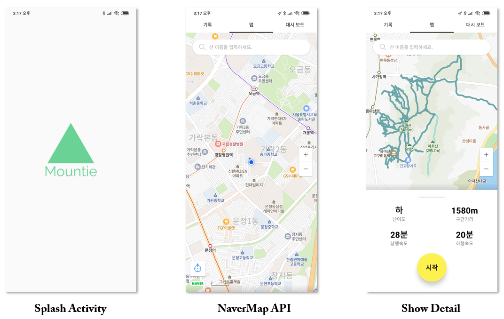
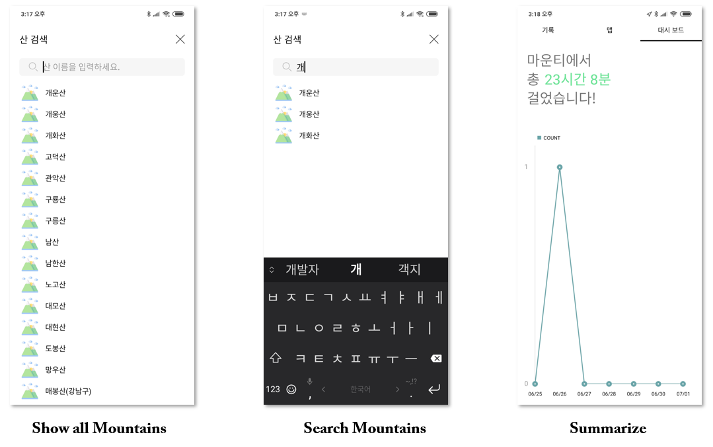
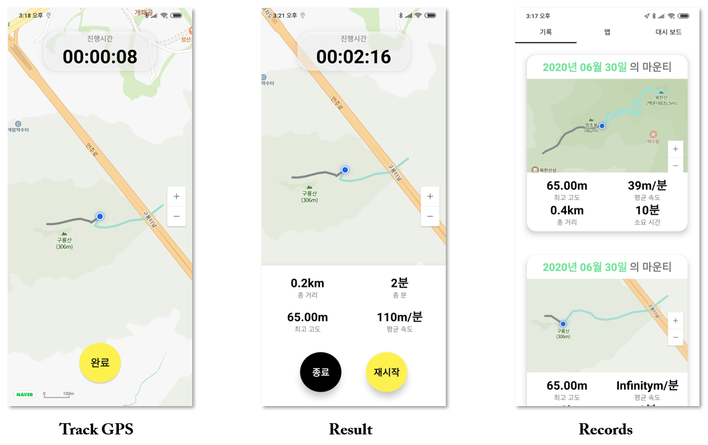

# Mountain + Bestie = Mountie
 

## Your Best friend when you hike. 
`Do you wanna hike?`
`Be with me!!`
## Description

Our application is for beginner of hiking. 

4 Main Functions here.

1. **Map**: You can show the hiking trail on the map where you want, and click on the hiking trail to reveal brief information of the hiking trail.

1. **Navigation**: Click on the hiking trail to start the navigation function. If you follow the road, you can check how far you are. Because the whole road is gray and the road to go is mint.

1. **Record**: After climbing, his mountain climbing record will remain in the record view, and he used the Shared Preference to keep the record intact even when the app was closed.

1. **Dashboard**: If the data is stacked on the record, wouldn't it be possible to make a dashboard with that record? You can see the total amount of time you spent climbing mountains and the number of hiking trails you have been hiking every week.

## Demo Images

## Demo Video

## Key features
- Show all hiking trails in Korea
- Search near mountain trails
  * Matching the hiking trail closet to my current location
- Record when you hike and save it
  * Show captured photos and each information (altitude, time, speed, distance)
- Give information about trains(ex, level of difficulty, altitude)

## Progress
- Splash Activity
- Tab bar with viewpager
- Navermap sdk
- Get data with Retrofit from Open API
- Convert Json data to use
- Draw all trails on the map
- Search activity to search mountain with recycler view
  * Store mountain's information (name, latitude and longitude) with arraylist and show mountain's name with recycler view
  * You can search mountain by name and when you click the mountain's name, map goes to that mountain
- Record fragment to save hiking data
  * Upload maps and information captured by the navigation to the Records view
  * Each of the information from navigation (time, speed, distance, altitude) is saved to a storage location in the app using sharedPreference and then recalled to a record
- Dashboard fragment to show statistical graph
  * You can see how many hours you climbed by text and how many time you climbed by graph
  * We get data which is stored in shared preference and calculate it to show you 

## Technology
* `Retrofit2` 
Implement Data Model and get **network interaction** with this great Library.
I bet it save our life

* `MVP pattern`
We try to use **MVP design pattern** for being easy to read code and make a clean code.
Would be good habit in development

* `NaverMap open API`
Use NaverMap on **Map** and **Navigation** View. The reason is the latest updated map API and the UI would be familiar with us 

* `Gson`
Gson Libaray use in data parsing from the **raw json data to java class.**

* `LineChart`
Draw LineChart using MPAndroidChart library ( https://github.com/PhilJay/MPAndroidChart )

## Team Member

|   |신재형|유희진|정수경|전수환|
|:---:|:---:|:---:|:---:|:---:|
|Student ID|201634943|201632216|201835522|201835519|
|E-mail|shinplest@gmail.com|jiin20803@gmail.com|jsk_1025@naver.com|jsuhwan34@gmail.com|
|Github address|https://github.com/shinplest|https://github.com/Huijiny|https://github.com/JeongSuKyoung|https://github.com/JeonSuHwan|
|Role|Get API with retrofit, Implement and design Navigation Activity|Implement and design Navigation Activity|Implement and Design Dash-board view / Search Activity|Implement and design Record view|

